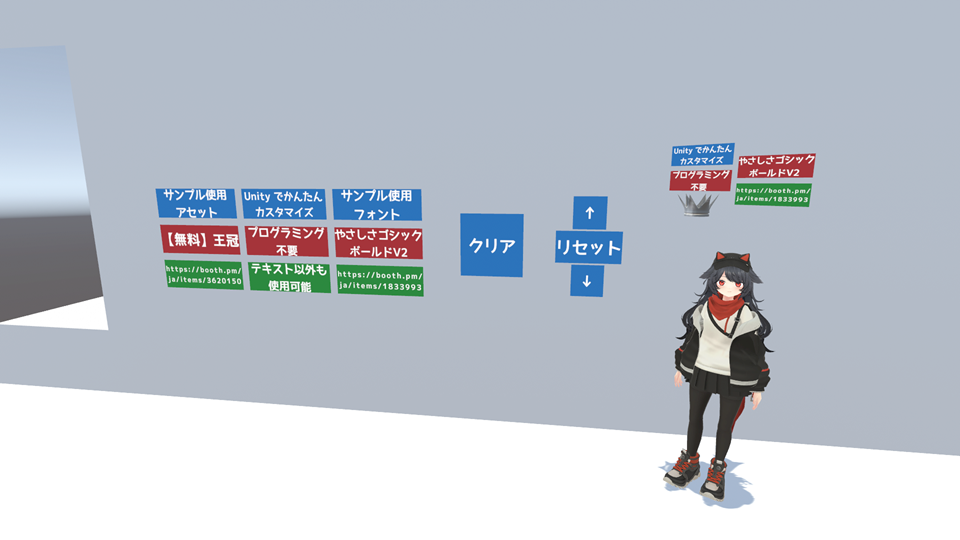

<!-- _class: title-slide -->
# ClusterScript でタグマーカー作ってみた

## TypeScript + Bun でリッチな開発体験

<div class="presenter">somnicat</div>
<div class="event-date">2025年5月24日</div>


---

<!-- _class: content-slide -->
# 自己紹介

**名前**:<span style="font-size: 1.5em;"> **somnicat**</span> (@somnicattus) 

**職業**: Web アプリケーションエンジニア

**よくいる場所**: VRChat の技術系集会と麻雀イベント

**よく使う技術**: TypeScript、関数型プログラミング

**ワールド制作歴**: 1 か月


---

<!-- _class: content-slide -->
# 動機

JavaScript は書けるので、せっかくなら ClusterScript に触っておきたい

VRChat でよく見るタグマーカーは Cluster では動かない
それっぽいものなら作れるかもしれないので題材にしてみる

ゆる JavaScript 雑談会で基本を教えてもらったので
せっかくなら自分のスキルと組み合わせてアウトプットしてみる

---

<!-- _class: content-slide -->
# ClusterScript とは

- Cluster ワールド/クラフトアイテム用のスクリプト
- JavaScript がベースで、Cluster 用のグローバル API が使える
- 1 つのアイテムに 1 つまでスクリプトをつけられる
- プレイヤーのローカルで実行され、サーバーを通じて同期される


---
<!-- _class: content-slide -->
# 実装方針と使用技術

- ロジックは ClusterScript で完結させる
  - **Gimmick は使用せず**、Unity 側は見た目とパラメータの設定に専念
- **TypeScript** で開発して型安全なスクリプトに
- **Bun** で複数のファイルをバンドル & ミニファイ
  - **バンドル**: 複数のスクリプトファイルを 1 つのファイルにまとめる
  - **ミニファイ**: 空白の削除や変数名の省略などでスクリプトを圧縮
  - npm や jsr のパッケージも使えるようになる（使わない）

---

<!-- _class: content-slide -->
# TypeScript とは

- JavaScript を拡張した言語で、型の静的解析ができる
- 書いたコードは JavaScript に変換（トランスパイル）できる
- ジェネリクスや条件付き型でごにょごにょできて楽しい
- JavaScript にない追加機能や試験的機能もある（使わない）


---
<!-- _class: content-slide -->
# Bun とは

- **実行速度**が売りの JavaScript 実行環境 (Node.js や Deno の仲間)
- パッケージ管理と TypeScript のビルドもできる
- ビルドスクリプトが TypeScript で書ける
- ずっと使ってみたかったのでついでに試す


---
<!-- _class: content-slide -->
# Bun のビルドスクリプト

```typescript
import { readdir } from 'node:fs/promises';
import path from 'node:path';

const source = './scripts';
const destination = '../Assets/Scripts';

// Cleanup (省略)
// Build
const files = await readdir(source);
const entrypoints = files.map((file) => path.join(source, file));
await Promise.all(
  entrypoints.map((entrypoint) =>
    Bun.build({ entrypoints: [entrypoint], outdir: destination, minify: true }),
  ),
);
```

---

<!-- _class: content-slide -->
# タグマーカーシステムの要件と構成

- ボタンを押すとプレイヤーの頭上にタグを表示
- ボタンで各タグの表示/非表示を切り替え


---

<!-- _class: content-slide -->
# できたもの



---
<!-- _class: content-slide -->
# つまづいたこと（解決済み）

- ワールド更新しても動作が変わらない/更新すると動作が崩れる
  - `$.onStart()` は新規スペースを開始しないと動かない
  → そもそも使わないことに（開発体験が悪い）
- テキストを表示する `TextView` を `$.createItem()` で生成できない
  - `TextView` はワールドコンポーネントなので動的に生成できない
  → Text Mesh Pro で表示して、日本語フォント用メッシュは自分で用意
- タグの表示位置がアバターごとの身長に合わない
  - ベータ機能で `Head` ボーンの位置を取得して調整
  - 念のため表示高さ調整ボタンも設置
---
<!-- _class: content-slide -->
# 残っている課題

- 横を向くとタグが見えない
  - どの視点で見ても正面に見えるようなカスタム Renderer が要りそう
- プレイヤーを追従する挙動がブレて見える
  - `$.setPosition()` で位置を追跡すると同期がずれる
  → タグをクラフトアイテム化してプレイヤーに持たせる必要がありそう
- ローカル非表示機能が効率的に作れない
  - `$.setVisiblePlayers()` だけだと面倒な状態管理が必要
- 配布するなら Unity エディタ拡張が欲しい

---
<!-- _class: content-slide -->
# まとめと感想


- ClusterScript でインタラクティブな機能を実装できた
  - それなりに動くものができてうれしい
- TypeScript と Bun で快適な開発体験にできた
  - 自分のスキルセットを Cluster に持ってこれてうれしい
  - Bun はサクッと何か作るのによさそう

---

<!-- _class: content-slide -->
# 使用したコード

GitHub で公開

このシステムのスクリプト部分
https://github.com/somnicattus/cluster-vr-tag-marker-system

ClusterScript を TypeScript + Bun で開発するテンプレート
https://github.com/somnicattus/cluster-script-template

このスライド
https://github.com/somnicattus/presentation-slide-2025-05-24

---

<!-- _class: title-slide -->
# ありがとうございました
